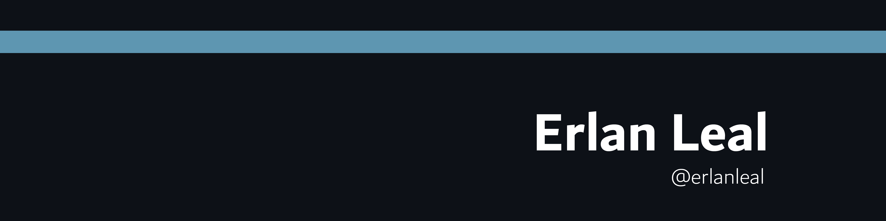
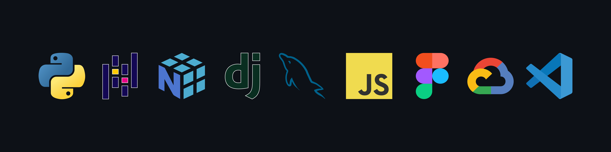

	

- 🔥 Python Developer / Data Analyst
- 🔭 I’m currently working on Suridata Healthcare and Cost Solutions
- 🌱 I’m currently learning more about Data Science techniques
- 💬 Ask me about **Python**, **Pandas**, **Matplotlib**, **Numpy**, etc.
  

## 💻 &nbsp;Things I code with

	

## ✌🏻 &nbsp;About me

  

	

